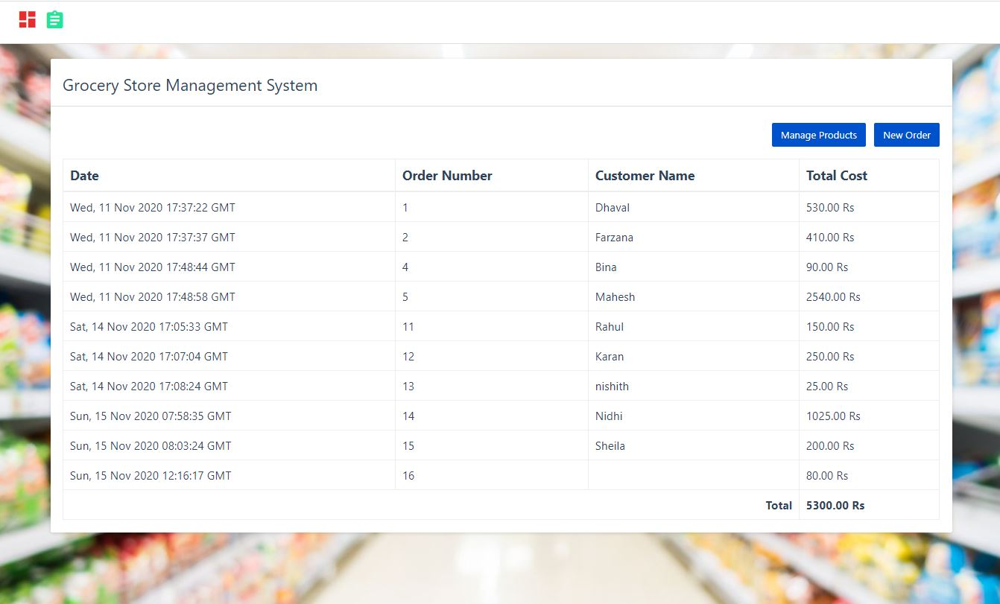

# 🛒 Grocery Store Management System

A **3-tier web application** for managing grocery products, customer orders, and inventory — built with **Python (Flask)**, **MySQL**, and a responsive **Bootstrap-based UI**.

---

## 📂 Project Architecture
1. **Frontend:** HTML, CSS, JavaScript, Bootstrap  
2. **Backend:** Python (Flask)  
3. **Database:** MySQL  



---

## 🚀 Features

### 🏬 Product Management
- Add, update, and delete grocery products  
- Assign **Unit of Measurement (UOM)** to each product  

### 📦 Order Management
- Create and manage customer orders  
- Automatic total price calculation  

### 💻 Interactive UI
- Responsive layout with Bootstrap  
- Sidebar navigation menu for quick access  

### 🗄 Database Integration
- MySQL backend for persistent data storage  
- **DAO Pattern** for clean and modular database operations  

---

## ⚙️ Installation & Setup

### 1️⃣ Clone the Repository
```bash
git clone https://github.com/bh-trishna/Grocery-Store-Management-System.git
cd grocery_app
````

### 2️⃣ Set Up Virtual Environment (Optional but Recommended)

```bash
python -m venv venv
# Activate virtual environment
# Mac/Linux:
source venv/bin/activate
# Windows:
venv\Scripts\activate
```

### 3️⃣ Install Dependencies

```bash
pip install -r requirements.txt
```

### 4️⃣ Configure MySQL Database

* Create a new database (e.g., `grocery_db`)
* Update **`sql_connection.py`** with your database credentials
* Run the SQL scripts to create tables:

  * `products`
  * `orders`
  * `uom`

### 5️⃣ Run the Backend Server

```bash
python backend/server.py
```

### 6️⃣ Open the Frontend

* Open `ui/index.html` directly in your browser
  **OR**
* Configure Flask to serve static files for a fully integrated app

---

## 📌 Tech Stack

* **Frontend:** HTML, CSS, JavaScript, Bootstrap
* **Backend:** Python (Flask)
* **Database:** MySQL

---

